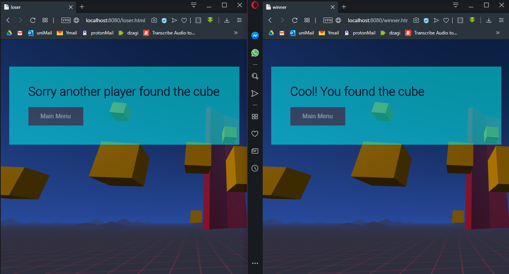

# aframe VR Multi-User Interaction  

Requirements:  
• Create a system that connects two users via WebSockets.  
• Create one collaborative (working with one another) multi-user interaction.  
• Create one competitive (working against one another) multi-user interaction.  
• There must be visual feedback letting each user know the current state of the system. 

<b>OVERVIEW</b> 
Find a cube against or with your friend. 
For visual feedback cubes change colour after been clicked.

